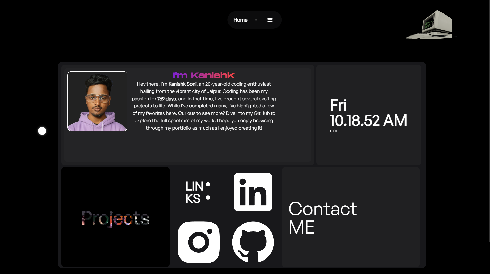
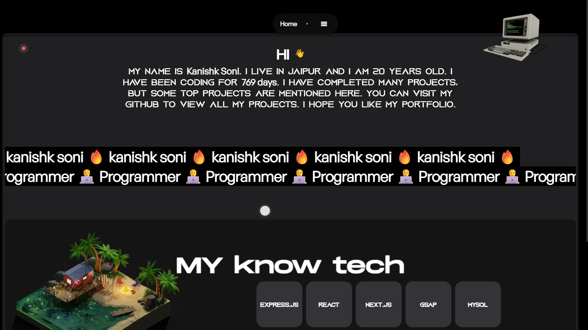
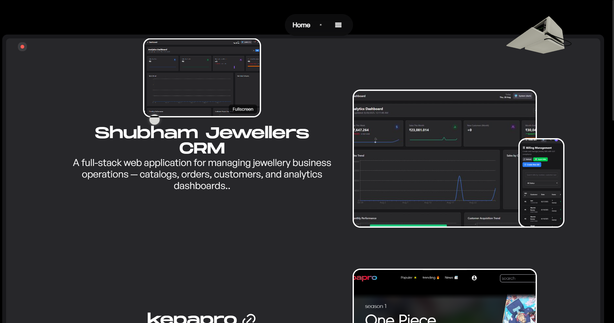

# My Portfolio

A modern, responsive developer portfolio built with **React** and **Vite**, styled using **Tailwind CSS**.  
Showcases my work, skills, and contact information in a clean, interactive layout.

---

## 🧰 Technologies Used

- **React** – Frontend framework
- **Vite** – Fast build tool and development server
- **Tailwind CSS** – Utility-first CSS framework
- **Framer Motion** – Animations & drag
- **React Three Fiber** – 3D model rendering
- **GSAP** – Scroll and animation effects
- **@react-three/drei** – 3D helpers
- **Lottie** – Animated icons
- **Session Storage** – UI state management
- **Custom Cursor & Click Effects**
- **ESLint** – Code linting and quality
- **PostCSS** – CSS processing

---

## 📁 Project Structure

```
my_portfolio/
├── public/
├── src/
│   ├── assets/
│   ├── components/
│   ├── pages/
│   ├── App.jsx
│   └── main.jsx
├── .eslintrc.cjs
├── tailwind.config.js
├── postcss.config.js
├── vite.config.js
├── package.json
└── README.md
```

---

## 🚀 Getting Started

### Prerequisites

- [Node.js](https://nodejs.org/) (v14 or above)
- npm or yarn installed

### Installation

1. Clone the repository:

   ```bash
   git clone https://github.com/kanishk1122/my_portfolio.git
   cd my_portfolio
   ```

2. Install dependencies:

   ```bash
   npm install
   # or
   yarn install
   ```

3. Start the development server:

   ```bash
   npm run dev
   # or
   yarn dev
   ```

4. Open your browser at `http://localhost:5173`

### Build for Production

```bash
npm run build
# or
yarn build
```

---

## 🔗 Live Demo

[🔗 View Portfolio Live](https://www.kansishk.me/)

---

## ✨ Features

- 🚀 Fully responsive design
- 🎯 Smooth scroll navigation
- 🧩 Reusable and modular components
- 📁 Project showcase with fullscreen video and links
- 🖱️ Animated custom cursor and click effects
- 🖥️ 3D model viewer (React Three Fiber)
- 📬 Contact section with email and social profiles
- 🌙 (Optional) Dark mode support

---

## 📸 Screenshots






---

## 📫 Contact

- GitHub: [@kanishk1122](https://github.com/kanishk1122)
- Email: [kanishk21soni@gmail.com](mailto:kanishk21soni@gmail.com)

---

## 📝 License

This project is licensed under the **MIT License**.  
Feel free to use, modify, and distribute it as you like.

---

## 🙌 Contributions

Contributions, issues, and feature requests are welcome!  
Feel free to open an issue or submit a pull request.

---

> Made with ❤️ by [kanishk1122](https://github.com/kanishk1122)
